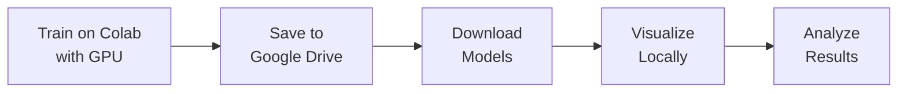

# 🚀 Google Colab + Local Workflow

## Complete Training & Visualization Workflow

This document describes the complete workflow for training agents on Google Colab with GPU and visualizing them locally.

---

## 📋 Overview



**Benefits:**
- 🚀 **10-100x faster training** with GPU/TPU
- 💰 **Free** with Google Colab
- 🎨 **High-quality visualizations** locally
- 💾 **Persistent storage** via Google Drive

---

## 🔄 Complete Workflow

### Step 1: Train on Google Colab (GPU)

#### 1.1 Open Training Notebook
🔗 **[Open in Colab](https://colab.research.google.com/github/ritikkumarv/autonomous-colony/blob/main/colab_training.ipynb)**

#### 1.2 Enable GPU
- Runtime → Change runtime type
- Hardware accelerator: **GPU**
- GPU type: **T4** (free) or **A100** (Pro)
- Save

#### 1.3 Configure Training
```python
TRAINING_CONFIG = {
    'n_agents': 4,
    'grid_size': 30,
    'n_episodes': 1000,
    'agent_type': 'ppo',
    'use_curiosity': True,
    'use_curriculum': True,
}
```

#### 1.4 Run Training
- Click **Runtime → Run all**
- Monitor live plots
- Wait for training to complete (~2-5 hours)

#### 1.5 Verify Training
Check the final stats:
```
Final Average Reward (last 100): 45.32
Final Success Rate (last 100): 78.5%
Best Episode Reward: 89.20
```

---

### Step 2: Save to Google Drive

Models are **automatically saved** to:
```
/MyDrive/autonomous_colony_models/
```

**Saved files:**
- `ppo_ep100_*.pt` - Checkpoint every 100 episodes
- `ppo_ep200_*.pt`
- ...
- `ppo_final_*.pt` - Final trained model

**What's saved:**
- Network weights
- Optimizer state
- Training history
- Configuration
- Performance metrics

---

### Step 3: Download Models

#### Option A: Download Zip (Recommended)

In Colab, run the last cell:
```python
# Zip and download all models
```

This downloads: `autonomous_colony_models_<timestamp>.zip`

**Extract locally:**
```bash
cd autonomous-colony
unzip ~/Downloads/autonomous_colony_models_*.zip -d models/
```

#### Option B: Manual Download

1. Open [Google Drive](https://drive.google.com)
2. Navigate to `My Drive/autonomous_colony_models/`
3. Select model files
4. Right-click → Download
5. Move to `models/` directory

#### Option C: Using Helper Script

```bash
# Show download instructions
python download_models.py

# Verify downloaded model
python download_models.py --verify models/ppo_final_*.pt

# List all local models
python download_models.py --list
```

---

### Step 4: Visualize Locally

#### 4.1 Basic Visualization

```bash
python visualize.py --model models/ppo_final_*.pt --episodes 10
```

**Outputs:**
- `visualizations/heatmaps.png` - Exploration patterns
- `visualizations/trajectories.png` - Agent paths
- `visualizations/dashboard.png` - Training metrics
- `visualizations/metrics.json` - Episode data
- `visualizations/summary.txt` - Statistics

#### 4.2 Save Individual Frames

```bash
python visualize.py \
  --model models/ppo_final_*.pt \
  --episodes 3 \
  --save-frames
```

Creates: `visualizations/ep0_step0001.png`, etc.

#### 4.3 Custom Configuration

```bash
python visualize.py \
  --model models/ppo_final_*.pt \
  --episodes 20 \
  --n-agents 4 \
  --grid-size 30 \
  --max-steps 500 \
  --output-dir results/viz_20250111
```

---

### Step 5: Analyze Results

#### 5.1 View Summary

```bash
cat visualizations/summary.txt
```

```
================================================================================
VISUALIZATION SESSION SUMMARY
================================================================================

Episodes: 10

Rewards:
  Mean: 45.67
  Std:  12.34
  Min:  15.20
  Max:  78.90

Episode Lengths:
  Mean: 245
  Std:  67
  Min:  120
  Max:  450

Success Rate: 80.0%

Per-Episode Details:
  Episode 0: Reward=45.20, Steps=234, Success=✓
  Episode 1: Reward=67.80, Steps=312, Success=✓
  ...
```

#### 5.2 Examine Metrics

```bash
cat visualizations/metrics.json | python -m json.tool
```

#### 5.3 View Visualizations

```bash
# Open heatmaps
xdg-open visualizations/heatmaps.png

# Open trajectories
xdg-open visualizations/trajectories.png

# Open dashboard
xdg-open visualizations/dashboard.png
```

---

## 🎯 Example Sessions

### Quick Test (30 min on T4)

**Colab Configuration:**
```python
{
    'n_episodes': 500,
    'n_agents': 2,
    'grid_size': 20,
    'agent_type': 'ppo',
}
```

**Local Visualization:**
```bash
python visualize.py --model models/ppo_final_*.pt --episodes 5
```

---

### Standard Training (2-3 hours on T4)

**Colab Configuration:**
```python
{
    'n_episodes': 2000,
    'n_agents': 4,
    'grid_size': 30,
    'agent_type': 'ppo',
    'use_curiosity': True,
    'use_curriculum': True,
}
```

**Local Visualization:**
```bash
python visualize.py \
  --model models/ppo_final_*.pt \
  --episodes 20 \
  --save-frames \
  --output-dir results/ppo_2000ep
```

---

### Advanced Training (5-6 hours on T4)

**Colab Configuration:**
```python
{
    'n_episodes': 5000,
    'n_agents': 6,
    'grid_size': 40,
    'agent_type': 'mappo',
    'use_curiosity': True,
    'use_curriculum': True,
}
```

**Local Visualization:**
```bash
python visualize.py \
  --model models/mappo_final_*.pt \
  --episodes 50 \
  --n-agents 6 \
  --grid-size 40 \
  --output-dir results/mappo_5000ep
```

---

## 🔍 Comparing Models

### Train Multiple Configurations

**Session 1: PPO Baseline**
```python
'agent_type': 'ppo',
'use_curiosity': False,
```

**Session 2: PPO + Curiosity**
```python
'agent_type': 'ppo',
'use_curiosity': True,
'curiosity_type': 'icm',
```

**Session 3: PPO + Curriculum**
```python
'agent_type': 'ppo',
'use_curiosity': False,
'use_curriculum': True,
```

### Compare Locally

```bash
# Visualize each
python visualize.py --model models/ppo_baseline.pt --output-dir results/baseline
python visualize.py --model models/ppo_curiosity.pt --output-dir results/curiosity
python visualize.py --model models/ppo_curriculum.pt --output-dir results/curriculum

# Compare summaries
diff results/baseline/summary.txt results/curiosity/summary.txt
```

---

## 💡 Best Practices

### Training on Colab

1. **Start with small tests** (100-500 episodes)
2. **Monitor GPU usage** with `!nvidia-smi`
3. **Save frequently** (every 100 episodes)
4. **Use curriculum learning** for faster convergence
5. **Train overnight** for best results

### Downloading Models

1. **Download immediately** after training
2. **Use zip method** for multiple models
3. **Verify models** before deleting from Drive
4. **Organize by date/config** locally

### Local Visualization

1. **Test with few episodes** first (5-10)
2. **Use --no-render** for faster processing
3. **Save frames** only when needed (large files)
4. **Create separate output dirs** for comparisons

---

## 🐛 Troubleshooting

### Colab Issues

**GPU Not Available**
```python
# Check GPU allocation
!nvidia-smi
```
Solution: Runtime → Change runtime type → GPU

**Session Timeout**
- Colab disconnects after ~12 hours
- Use `save_interval: 100` for frequent checkpoints
- Download models periodically

**Out of Memory**
```python
RuntimeError: CUDA out of memory
```
Solution: Reduce `grid_size`, `n_agents`, or `batch_size`

### Download Issues

**Models Not in Drive**
- Check: `/MyDrive/autonomous_colony_models/`
- Re-run mount drive cell
- Grant permissions when prompted

**Download Slow**
- Use zip method instead
- Download during off-peak hours
- Try Google Drive Desktop app

### Visualization Issues

**Model Loading Error**
```python
KeyError: 'network_state_dict'
```
Solution: Ensure agent type matches model:
```bash
# For PPO models
python visualize.py --model models/ppo_*.pt

# For DQN models
python visualize.py --model models/dqn_*.pt
```

**Short Episodes**
- Agent needs more training
- Try different agent configurations
- Check reward shaping

---

## 📚 Next Steps

After successful training and visualization:

1. **Experiment** with different configurations
2. **Compare** agents (PPO vs DQN vs MAPPO)
3. **Analyze** learned behaviors
4. **Share** results in GitHub discussions
5. **Contribute** improvements

---

## 🔗 Resources

- 📖 [Colab Training Guide](COLAB_TRAINING.md)
- 🎨 [Visualization Guide](README.md#visualization)
- 🧠 [RL Concepts](ENHANCEMENTS_SUMMARY.md)
- 💬 [Get Help](https://github.com/ritikkumarv/autonomous-colony/issues)

Happy Training! 🚀
